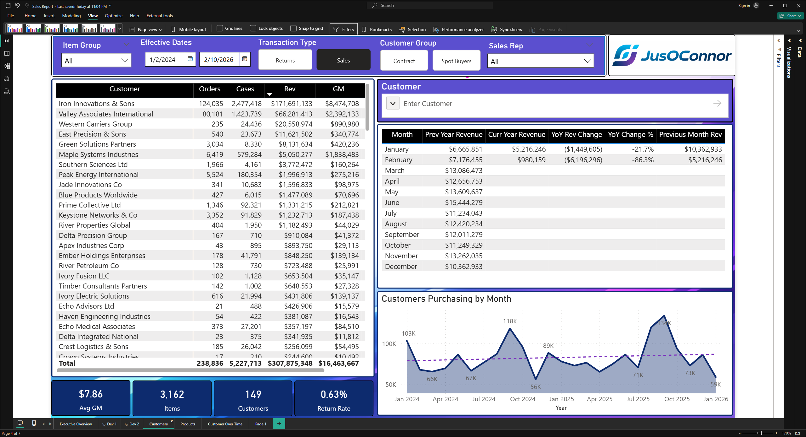
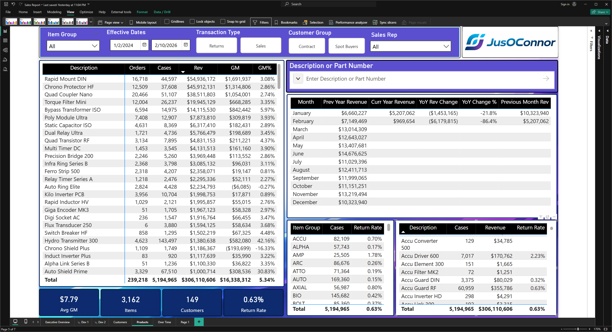
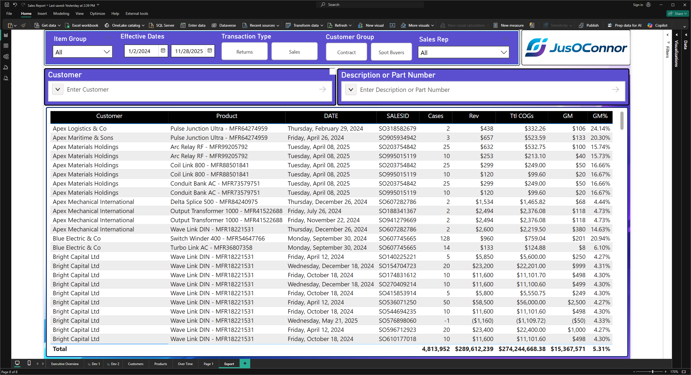

## Sales Dashboard - Power BI | In Development
This is currently a work in progress "Sales Report" concept.  Tab names, and layouts may change. The data was created using Claude 
and modified to fit in a hybrid Star/Snowflake schema to balance query performance with flexibility. The prompt called for a small- to 
medium-sized business with naming conventions inspired by Microsoft Dynamics.

*This dashboard would be updated every morning to ensure the previous day is captured in full.*  
___
**Executive Summary:**  
The slicers at the top allows the user to filter on the Item Group, Sales Type, Customer Group, 
and the Sales Rep. 
The light blue section shows the previous date's data. The Cases, Revenue, Gross Margin, and 
Gross Margin percentage are shown.  

The dark blue section shows the month to date Cases, Revenue, and Gross Margin. I also include 
the Run Rate calculations for each based on a Monday through Friday work week.  

The next blue section shows the previous month's metrics.  

The gauge currently shows the year to date revenue vs plan. The plan is based on an assumed 15% 
growth over the previous year overall. Since revenue is currently below plan, the gauge color is 
automatically set to red.  

The two purple cards below the gauge show the current annual run rate for the revenue and the 
actual plan.  

The lower half of the page is driven off the slicer on the left. This is utilizing the Parameter 
function allowing users to adjust the metrics for both the matrix and chart by selecting the 
measure from the slicer.  

*Mobile view*

___

**Customer Summary**  
The slicers are similar to the *Executive Summary* tab with the addition of the Effective Dates which drives all the visuals as well as a Customer input slicer which is driven off a new field that combines both the Customer Name and Account Number allowing both values to be searched.  

The table on the left shows all the Customers, Orders, Cases, Revenue, and Gross Margin based on the Effective Dates.

The table on the right is by Month and compares the revenue for the Previous Year, Current Year, Year-over-Year Change, percent change, and Previous Month Revenue.

The bottom left has 4 cards highlighting the Average GM, Number of Items sold, Number of Unique Customers, and Return Rate percentage.  

The bottom right highlights the number of Unique Customers by Month with a trendline.

___

**Product Summary**
This tab matched the functionality of the *Customer Summary* tab with the focus moving over to the Products.  
Similar to the Customer input slicer the driver is based off a new field that combines both the Description and Part Number that allows both values to be searched.

The bottom right has two tables. The left table is broken down by Item Group with Cases and the Return Rate.  The right table is broken down by Description, Cases, Revenue, and Return Rate %.

___

**Over Time**  
The slicers on this tab feature the Item Group, Effective Dates, Transaction Type, Customer Group, and Sales Rep.  The also has the measure slicer that is utilizing the Parameter function allowing users to adjust the metrics for both the matrix and chart by selecting the measure from the slicer.  

Both tables are by Year and allow users to expand down one level to the month. the top table features the Customers while the bottom table features Products.

___

**Export**  
The slicers on this tab mirror previous tabs.  The intent of this tab is to serve as "self-service" option for users who want to export the raw data/

___

## Roadmap
- [x] Add Export tab for users who still need Excel
- [ ] Add Month over Month Detail tab
- [ ] Add Year over Year Detail tab
- [ ] Add Weekly Detail tab
- [ ] Add Top Customer and Product Detail tabs
- [ ] Add Negative and/or Low Margin Transactions Details for review
- [ ] Add additional mobile views
- [ ] Finalize tab names and layout
- [ ] Clean up README descriptions and names to reflect final version